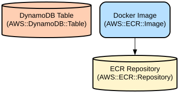

# Express.js API with AWS Integration and Docker Support

A Node.js REST API service that provides country management capabilities with AWS DynamoDB integration, distributed tracing via AWS X-Ray, and containerized deployment support.

This project implements a microservice architecture using Express.js framework with built-in monitoring and observability features. It provides endpoints for managing country data, includes comprehensive logging, and supports cross-origin resource sharing (CORS). The application is containerized using Docker and can be deployed to AWS ECS with automated build and deployment pipelines.

## Repository Structure
```
.
├── app.js                 # Main application entry point with Express.js setup
├── buildspec.yml          # AWS CodeBuild configuration for CI/CD
├── Dockerfile            # Container definition for Docker deployment
├── package.json         # Project dependencies and scripts
└── src/
    ├── controllers/     # Business logic implementation
    │   ├── country.controller.js    # Country CRUD operations
    │   ├── dummy.controller.js      # Test endpoint
    │   └── other.controller.js      # External API integration
    ├── persistence/
    │   └── dynamoClient.js          # AWS DynamoDB client wrapper
    ├── routes/          # API route definitions
    │   ├── country.route.js         # Country endpoint routes
    │   ├── dummy.route.js           # Test endpoint routes
    │   └── other.route.js           # External API routes
    └── utils/
        └── logger.js    # Winston logger configuration
```

## Usage Instructions
### Prerequisites
- Node.js 14.19.3 or later
- Docker (for containerized deployment)
- AWS Account with configured credentials
- AWS DynamoDB table
- AWS X-Ray permissions

### Installation

#### Local Development
```bash
# Clone the repository
git clone <repository-url>
cd <repository-name>

# Install dependencies
npm install

# Create .env file with required environment variables
cat << EOF > .env
PORT=80
AWS_REGION=us-east-1
TableName=your-dynamodb-table
EOF

# Start the application
npm start

# For development with auto-reload
npm run debug
```

#### Docker Deployment
```bash
# Build the Docker image
docker build -t testapi:latest .

# Run the container
docker run -p 80:80 \
  -e AWS_REGION=us-east-1 \
  -e TableName=your-dynamodb-table \
  testapi:latest
```

### Quick Start
1. Start the server:
```bash
npm start
```

2. Test the basic endpoint:
```bash
curl http://localhost:80/api/dummy
```

3. Manage countries using the API:
```bash
# Get all countries
curl http://localhost:80/api/country

# Delete a country
curl -X DELETE http://localhost:80/api/country/{id}
```

### More Detailed Examples
```javascript
// Get all countries
GET /api/country

// Create a new country
POST /api/country
Content-Type: application/json

{
  "code": "US",
  "name": "United States"
}

// Delete a country
DELETE /api/country/US
```

### Troubleshooting

#### Common Issues
1. DynamoDB Connection Issues
   - Error: "Cannot access DynamoDB table"
   - Solution: Check AWS credentials and table permissions
   - Debug: Enable AWS SDK debug logging:
     ```bash
     export AWS_SDK_DEBUG=true
     ```

2. Docker Build Failures
   - Error: "Could not resolve npm packages"
   - Solution: Check network connectivity and npm registry access
   - Debug: Build with verbose output:
     ```bash
     docker build --progress=plain -t testapi:latest .
     ```

#### Debugging
- Application logs are available through Winston logger
- AWS X-Ray provides distributed tracing
- Check Docker logs:
  ```bash
  docker logs <container-id>
  ```

## Data Flow
The application processes requests through a layered architecture, from routes through controllers to the DynamoDB persistence layer.

```ascii
Client Request → Express Router → Controller → DynamoDB Client → AWS DynamoDB
     ↑                                            ↓
     └────────────── JSON Response ──────────────┘
```

Key component interactions:
1. Express.js routes direct requests to appropriate controllers
2. Controllers implement business logic and data validation
3. DynamoDB client handles database operations with X-Ray tracing
4. Winston logger records all requests and operations
5. AWS X-Ray provides distributed tracing across components

## Infrastructure


AWS Resources:
- DynamoDB:
  - Table: Defined by `TableName` environment variable
  - Primary Key: "Code"

- ECR (Elastic Container Registry):
  - Repository: `testapi`
  - Image tag: `test`

- AWS X-Ray:
  - Service name: "Dummy"
  - Plugins: ECSPlugin enabled

## Deployment
Prerequisites:
- AWS CLI configured
- ECR repository created
- Required IAM roles and permissions

Deployment steps:
1. Build and push Docker image:
```bash
aws ecr get-login-password --region us-east-1 | docker login --username AWS --password-stdin $AWS_ACCOUNT_ID.dkr.ecr.us-east-1.amazonaws.com
docker build -t testapi:test .
docker buildx build --build-arg PORT=9000 --platform linux/amd64,linux/arm64 -t testapi:test .
docker tag testapi:test $AWS_ACCOUNT_ID.dkr.ecr.us-east-1.amazonaws.com/testapi:test
docker push $AWS_ACCOUNT_ID.dkr.ecr.us-east-1.amazonaws.com/testapi:test
```

2. Deploy using AWS CodeBuild:
- Commit and push changes
- CodeBuild will automatically build and deploy using buildspec.yml configuration